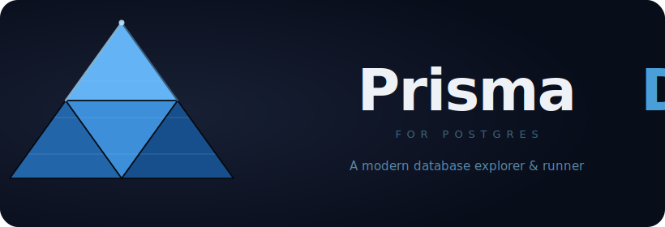

<p align="center">
  
</p>

<p align="center">
  <a href="https://github.com/britors/Prisma4Postgres/releases">
    
  </a>
  <a href="https://github.com/britors/Prisma4Postgres/blob/main/LICENSE">
    
  </a>
  <a href="https://github.com/britors/Prisma4Postgres/issues">
    
  </a>
</p>

**Prisma4Postgres** is a standalone Electron desktop app for exploring PostgreSQL databases and working with Prisma ORM — all without leaving a dedicated workspace. No VS Code required, no CLI wrappers, no config files: just connect and explore.

---

## Layout

```
┌──────────────────┬──────────────────────────────────────────────┐
│                  │  [Query] [History] [Prisma]                  │
│  Explorer        ├──────────────────────────────────────────────┤
│  (left sidebar)  │  Monaco SQL editor                           │
│                  ├╌╌╌ drag to resize ╌╌╌╌╌╌╌╌╌╌╌╌╌╌╌╌╌╌╌╌╌╌╌╌╌┤
│  connections     │  Result grid / EXPLAIN plan                  │
│  └ schemas       └──────────────────────────────────────────────┘
│    └ tables
│      └ columns
└──────────────────
```

- **Left sidebar** always visible, drag handle to resize (160 – 600 px, persisted)
- **Right area** holds Query, History, and Prisma tabs
- **Query/Results split** resizable (default 50/50, persisted per session)

---

## Features

### Explorer (left sidebar)
- Tree view of all schemas, tables, views, and functions
- Folder icons matching **OpenBase.Icons** style — open/closed per node state
- Column details with PK / FK badges and data types
- Prisma model indicator on mapped tables
- Filter / search nodes in real time
- Drag handle to resize the sidebar

### SQL Query Editor
- Monaco editor with SQL syntax highlighting and live autocomplete
- Multi-tab queries — each tab shows an SQL file icon + name
- **`Ctrl+Enter`** or **`F8`** to run (runs selection if text is selected)
- Connection selector per tab
- Resizable split between editor and results (drag the divider)
- Result grid with NULL highlighting
- Export results as **CSV** or **JSON** via save dialog
- Query history (last 50 runs, searchable, click to restore)

### EXPLAIN Plan Viewer
- One-click `EXPLAIN (ANALYZE, BUFFERS, FORMAT JSON)` via **Explain** button
- Expandable node tree with cost, actual time, and row counts
- Expensive nodes highlighted (Seq Scan, high relative cost)
- Toggle between tree view and raw JSON

### Schema Inspection
- Full DDL viewer with Monaco read-only (`CREATE TABLE` reconstructed from `pg_catalog`)
- Indexes & constraints panel (size, type badges, definitions)
- FK Map — outgoing and incoming foreign keys, click to navigate tree

### Prisma Integration
- Browse for `schema.prisma` via file dialog; path persisted in settings
- Maps models to database tables — ✓ found / ✗ missing indicator
- **Drift panel**: Prisma model fields vs actual DB columns with type compatibility check
- Run **`prisma db pull`** with real-time streaming log
- Run **`prisma migrate status`** with real-time streaming log
- Migration history from `_prisma_migrations` with status indicators

---

## Keyboard Shortcuts

| Shortcut | Action |
|---|---|
| `Ctrl+Enter` | Run query (or selection) |
| `F8` | Run query (or selection) |
| `Ctrl+Z` / `Ctrl+Y` | Undo / Redo in editor |

---

## Getting Started

### Add a connection

1. Click **+** in the Explorer sidebar header
2. Fill in host, port, database, user, and optional password
3. Click **Test** to verify connectivity, then **Save**

### Connect and explore

- Click the **plug icon** next to a connection to connect
- Expand the tree: schema → Tables & Views → columns
- Hover over a table for quick actions: Preview, DDL, copy name

### Run a query

1. Switch to the **Query** tab
2. Select your connection from the dropdown
3. Write SQL and press `F8` (or `Ctrl+Enter`)
4. Results appear in the bottom pane; drag the divider to resize
5. Click **Export** to save as CSV or JSON

### View EXPLAIN

With a SELECT query in the editor, click **Explain** to see the full query plan tree with cost and timing for each node.

### Prisma integration

Switch to the **Prisma** tab and click **Browse…** to select your `schema.prisma` file. Then:
- See all models with their mapped table names and existence status
- Run `db pull` or `migrate status` from the action buttons
- Click the **diff icon** next to any model to open the Drift panel

---

## Settings

Settings are stored in the app's user-data directory (`userData/settings.json`).

| Setting | Default | Description |
|---|---|---|
| `queryTimeout` | `30000` | Query timeout (ms) |
| `defaultPort` | `5432` | Pre-filled port for new connections |
| `defaultSsl` | `false` | SSL enabled by default for new connections |
| `showRowCount` | `false` | Show estimated row count badges in the Explorer |
| `prismaSchemaPath` | — | Last used `schema.prisma` path |

Passwords are encrypted with `electron.safeStorage` and stored separately in `userData/passwords.json`.

---

## Development

### Prerequisites

- Node.js 20+ (via [nvm](https://github.com/nvm-sh/nvm) recommended)
- npm

### Setup

```bash
git clone https://github.com/britors/Prisma4Postgres.git
cd Prisma4Postgres
npm install
```

### Run in development

```bash
npm run dev
```

### Run tests

```bash
npm test
```

46 unit tests covering `PgConnection` validation, `PrismaParser`, and `ConnectionManager`.

### Build for distribution

```bash
npm run package
```

Produces an **AppImage** (Linux), **dmg** (macOS), or **NSIS installer** (Windows) in `dist/`.

---

## Tech Stack

| Layer | Technology |
|---|---|
| Shell | Electron 29 |
| Language | TypeScript 5 |
| DB driver | node-postgres (`pg`) |
| SQL editor | Monaco Editor 0.45 (CDN) |
| Icons | [OpenBase.Icons](https://github.com/britors/OpenBase.Icons) style (inline SVG) |
| Theme | [OpenBase.Theme](https://github.com/britors/OpenBase.Theme) colors |
| Build | esbuild |
| Tests | Node built-in `node:test` + `tsx` |

---

## Contributing

See [CONTRIBUTING.md](CONTRIBUTING.md) for setup instructions, architecture overview, and coding guidelines.

Found a bug or have a feature request? [Open an issue](https://github.com/britors/Prisma4Postgres/issues).

---

## License

[MIT](LICENSE) © Rodrigo Brito
