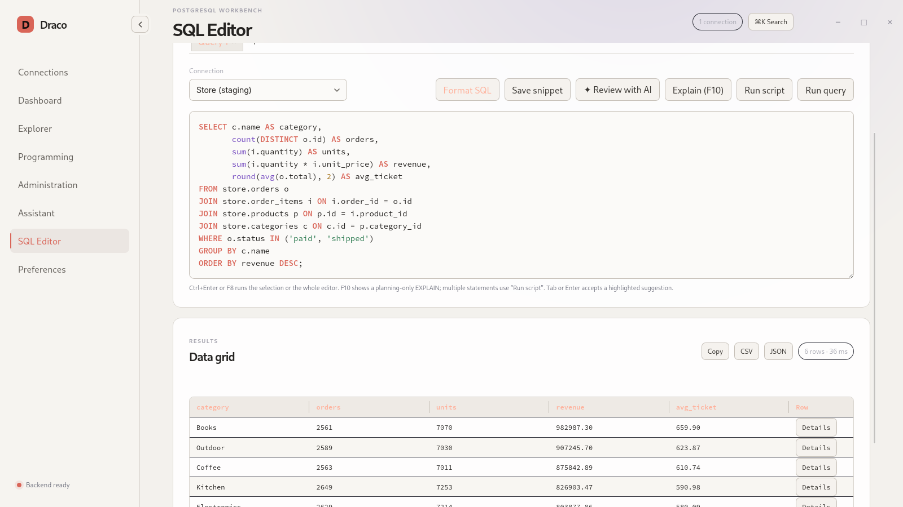
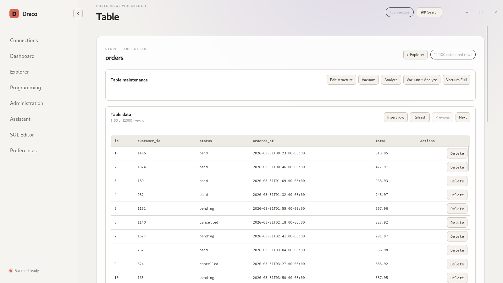
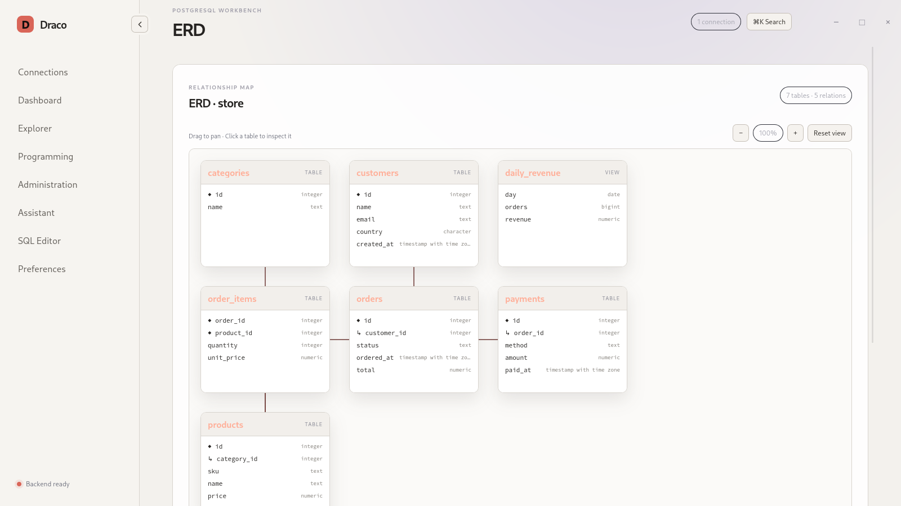
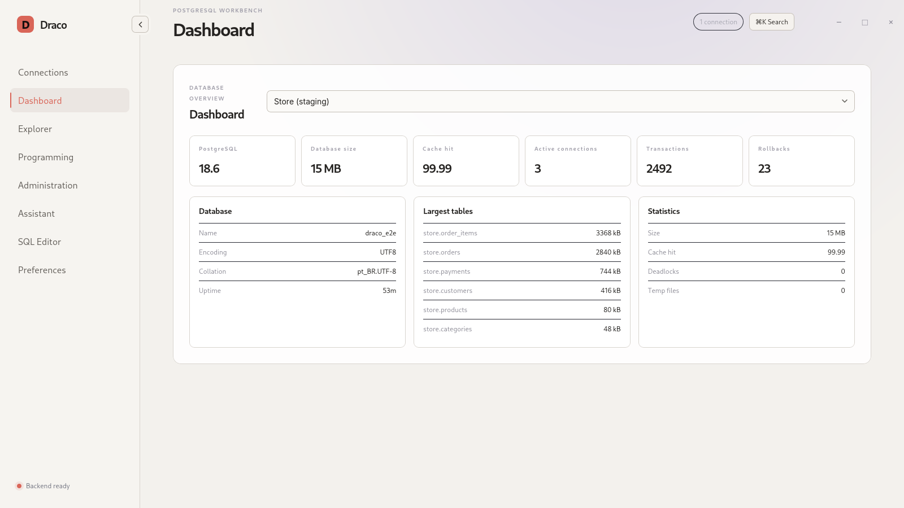
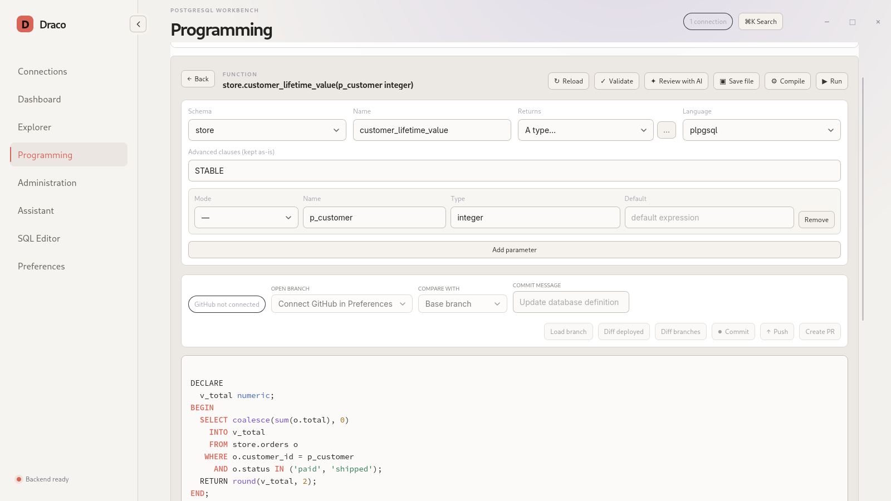

<p align="center">
  
</p>

<p align="center">
  <sub>Logo inspirado na imagem de referência gerada com <a href="https://www.craiyon.com/pt/image/Hem-omdSQoWd0VBfMnBbHg">Craiyon</a>.</sub>
</p>

<p align="center">
  <a href="https://github.com/britors/Draco/blob/main/LICENSE">
    
  </a>
  <a href="https://github.com/britors/Draco/issues">
    
  </a>
</p>

<p align="center">
  <a href="README.md">English</a> · <strong>Português</strong>
</p>

<p align="center">
  <strong><a href="https://dracodb.com.br">dracodb.com.br</a></strong> — site oficial do Draco Postgres, com downloads e instalação
</p>

**Draco** é o cliente de banco de dados do ecossistema **Lyra OS**: explorador de
esquemas, editor SQL e ferramenta de administração para PostgreSQL. Funciona em
qualquer distribuição Linux moderna, com integração visual prioritária ao Lyra
(GNOME/Wayland).



<p align="center">
  
  
  
  
</p>

As capturas usam um banco fictício e são geradas por
`scripts/capture-screenshots.sh` (veja [`docs/development/tauri.md`](docs/development/tauri.md)).

- Driver Postgres assíncrono (`tokio-postgres`) para queries — sem CLI externo
  (`psql`); backup/restauração usam explicitamente as ferramentas oficiais do
  PostgreSQL.
- Túnel SSH (incluindo jump host) feito em processo (`russh`), sem depender do
  binário `ssh`.
- Interface oficial Tauri 2, com frontend local sem CDN.
- Workbench Programming com tela dedicada e editor SQL para
  views/functions/procedures/triggers, além de editores validados de sequences
  e índices comuns.
- Integração nativa com GitHub: repositório configurável, branches, diff contra
  o banco implantado, comparação entre branches, commit e criação de pull request.
- Nenhuma senha ou passphrase é manuseada em texto plano — armazenamento
  delegado ao Serviço de Segredos do sistema (GNOME Keyring/KWallet, via
  `keyring`), já integrado ao sistema.

> **Status**: Tauri 2 é o único frontend e artefato oficial.

---

## Estrutura do repositório

- `draco-core`: pool Postgres, túnel SSH, queries de introspecção/DDL/stats,
  storage local (TOML/XDG) e segredos — sem dependência de nenhum toolkit
  gráfico.
- `draco-app`: casos de uso e DTOs serializáveis consumidos pelo shell Tauri.
- `src-tauri`: shell Tauri 2, capabilities mínimas e bridge IPC tipada.
- `frontend/dist`: shell web local empacotado pelo Tauri, sem dependências de
  rede em runtime.
- `data`: `.desktop` e metadados AppStream.
- `site`: site estático (português na raiz, inglês em `site/en/`) publicado em
  <https://dracodb.com.br> pelo workflow `Site` (GitHub Pages) a cada mudança na `main`.
- `packaging/obs`: artefatos para o pacote RPM no OBS
  (`home:rodrigosbrito:lyra/postgres-draco`).

## Compilando

Dependências de sistema para o app oficial (nomes Fedora/openSUSE): WebKitGTK
4.1, GTK3, OpenSSL, librsvg e `xdg-desktop-portal` (seletores de arquivo
nativos), além de um compilador Rust estável recente (`cargo`, `rustc` ≥ 1.85).

```sh
cargo build --locked --release -p draco-tauri
./target/release/draco
```

Para diagnóstico, use `RUST_BACKTRACE=1 cargo run -p draco-tauri`. Senhas e
conteúdo de query nunca são registrados nos logs.

### Testes

```sh
cargo test -p draco-core
cargo test -p draco-app
cargo test -p draco-tauri
(cd frontend && npm run check && npm test)
```

## Instalação

Cada tag `vX.Y.Z` gera e anexa à GitHub Release quatro pacotes nativos:

- instalador Windows x64 em NSIS (`.exe`), sem janela de console e instalado
  para o usuário atual por padrão;
- pacote `.deb` compilado no Ubuntu 24.04;
- pacote `.rpm` compilado no Fedora 43;
- pacote `.rpm` compilado no openSUSE Leap 16.0.

O RPM oficial via OBS (`home:rodrigosbrito:lyra/postgres-draco`) continua
disponível para openSUSE. O nome do pacote OBS não é "draco" simples porque
esse nome já é usado pelo projeto "graphics" do openSUSE; o aplicativo continua
se chamando Draco.

> **Release Tauri:** a versão `2.2.1` distribui pacotes nativos no GitHub para
> Windows, Ubuntu, Fedora e openSUSE e mantém o RPM oficial no OBS. Ela atualiza a ficha
> AppStream (resumo, descrição e notas de versão em inglês e português). A `2.2.0` trouxe conexão
> por URL `postgres://` e importação de `.pgpass`/`pg_service.conf`, ambientes e modo
> somente leitura por conexão, importação de CSV/JSON, monitor de replicação, diff de
> schema e notificação ao fim de operações longas.

## Licença

[GPL-3.0-or-later](LICENSE) © Rodrigo Brito
